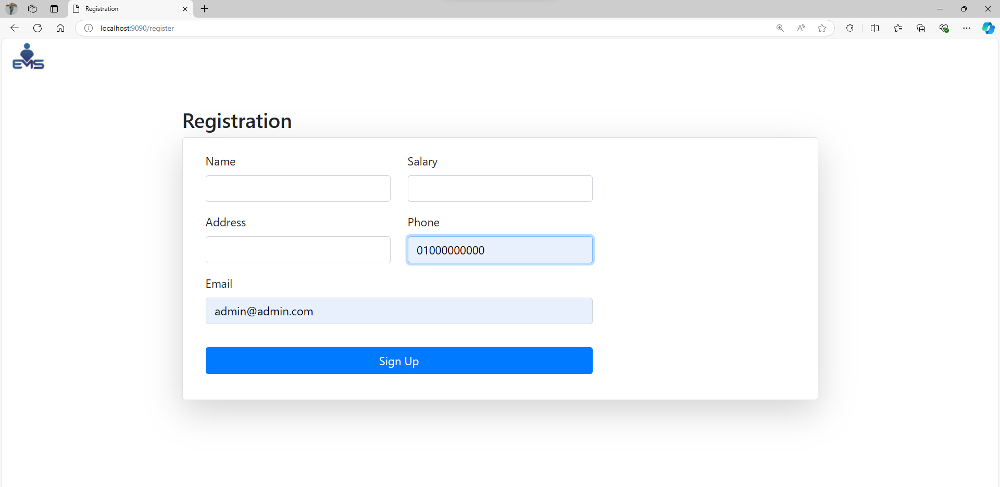
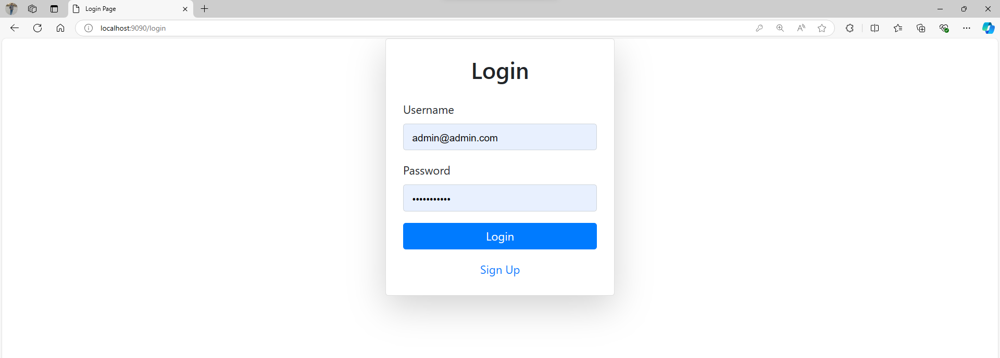
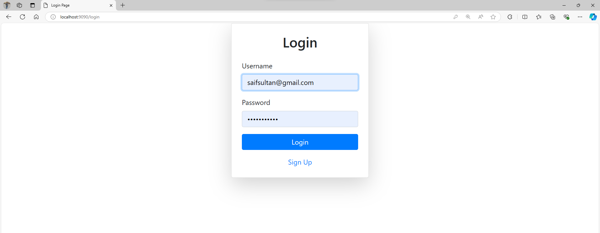
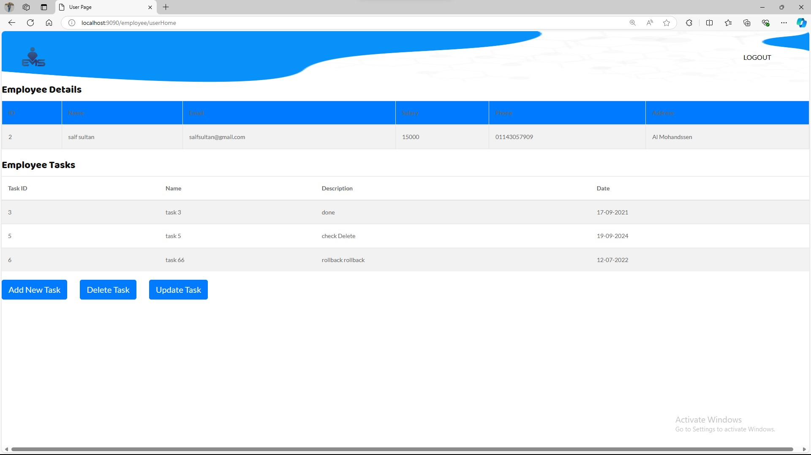

# EMS

Employee Management System.

## Features
### Admin Role 
 can list , add , update , search and delete employee.
 
### Employee Rple.
 can add , delete and update Tasks.

## Tech Stack
#### Springboot -> framework .

#### java -> language .

#### HTML & CSS(bootstrap) -> Frontend .

#### MySQL -> Database.

# Getting Started 


## Installation

first clone this project and open it in intellij (recommended).

open application.properties and change next line 
```java
spring.datasource.url=jdbc:mysql://localhost:your_port/your_schema  //change to your url
spring.datasource.username=your_username                            //change to your username 
spring.datasource.password=your_password                            //change to your password

spring.jpa.hibernate.ddl-auto=create-drop                          //to create table 
```
then change last line to before another run 
```java
spring.jpa.hibernate.ddl-auto=update
```
## Usage

After clone , change application.properties file and run program, open browser and search for [http://localhost:9090/login](http://localhost:9090/login).

first you must click to sign up and add new User with email admin@admin.com and password 01000000000.

.

then you can login as a admin to add more employee.

.

now you can take control as Admin and can list , add , update , search and delete employee.

.

After add new employee you can login with this email and password to add new tasks.

.

##### note !! your password is a phone number 
now you can take control as Admin and can add , delete and update Tasks.

.

### please act as admin and user 
## future work 
Apply Spring Security and handle password challenge


#### For Any Question please communicate with me [Linkedin](https://www.linkedin.com/in/seif-eldin-sultan-90b740233/)
